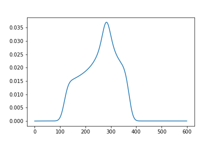
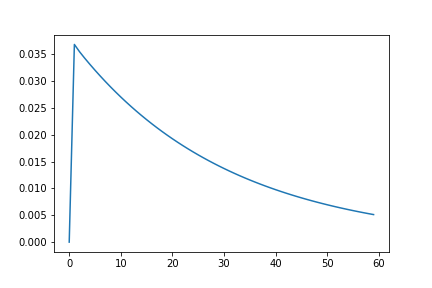

===============
Getting started
===============

Download teacups
================

You can download **teacups** via git::

   git clone 'https://gitlab.physchem.uni-freiburg.de/koesters/teacups.git'

Installation
============

.. note::

   Anaconda is used for development and so it is highly recommended. Virtualenv might 
   be possible, but there is no guarantee for full functionality!

#. Open a Conda-Shell

#. Setup a new conda environment::

      conda create -n teacups
   
   .. note::
   
      You can also use another environment name or use an existing environment. It is
      recommended to use a new environment to avoid side effects.

#. Activate the conda environment::

      conda activate teacups

#. Install necessary packages::

      conda install numpy scipy matplotlib tqdm

#. Add the cloned directory to your pythonpath::
    
      .../teacups/src/
	
   .. note::
   
      You can add the path e.g. in an IDE like Spyder in which you want to run the code.

Test your installation
======================

Run the following script in an IDE of your choice::

	import teacups.classes as cl
	import teacups.simulations as sim
	import matplotlib.pyplot as plt

	Sys = cl.Sys()
	Exp = cl.Exp()
	SimOpt = cl.SimOpt()

	spec = sim.teacups(Sys, Exp, SimOpt)

	plt.figure()
	plt.plot(spec[5])
	plt.figure()
	plt.plot(spec[:, 300])

You should receive the following two images:

