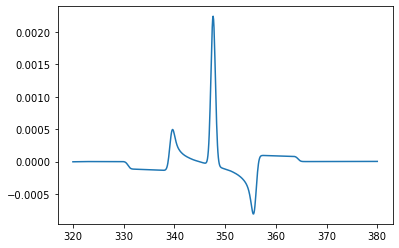
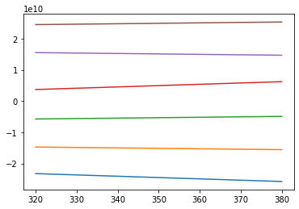
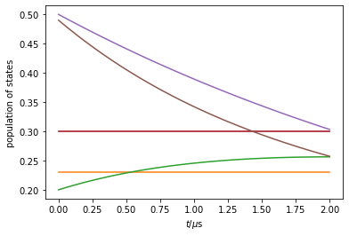
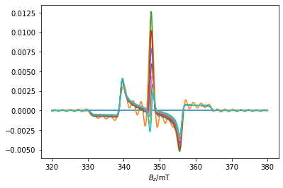
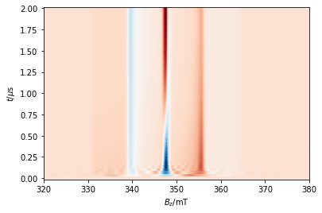

..    include:: <isonum.txt>

========
Tutorial
========

This tutorial will teach you the basics to write your first scripts. It **does** show you

* How to set up a simple spin system
* How to use the classes provided by teacups
* How to start a teacups simulation
* Where to find the outputs
* A possible workflow for determining a plausible relaxation mechanism

It **doesn't** show you how to

* program using Python3 (`here are Python3 tutorials <https://docs.python.org/3/tutorial/>`__)
* use all features of the routine. See the sections about the Spinsystem, Experimental and Simulationoptions for further information about possible attributes.

The main simulation function
============================
The simulation is done by the main simulation function. You can use the function by importing the simulations module from the teacups package::
	
	import teacups.simulations as sim

Then it can be called in your script::
	
	spec = teacups(Sys, Exp, SimOpt)

Input classes provided by teacups
=================================
As you can see above the main simulation function needs three classes as input. In your script theses classes need to be set up. Their attributes define the spin system parameters (Sys), the experimental parameters (Exp) and the simulation options (SimOpt). You can import the classes form the classes module by::

	import teacups.classes as cl
	
	Sys = cl.Sys()
	Exp = cl.Exp()
	SimOpt = cl.SimOpt()
	
Some important parameters are predefined but can be easily changed by setting the attribute in your skript. You can look at all attributes by typing::

	vars(Sys)
	vars(Exp)
	vars(SimOpt)

To get a full overview of all possible attributes please consult the specific section in the documentation.

A first simulation
==================

Define necessary inputs
-----------------------
After importing the classes and simulation modules and setting up the (nearly) empty classes you can fill your skript with live by defining the necessary inputs. The default syntax is::
	
	Class.Attribute = Value

In the following some important attributes are listed. They are either obligatory (o) or it is at least recommended (r) to set a good value. The explanation for the attributes and possible values can be found in the specific section of the documentation or you can consult the :download:`quick reference </quickreference.pdf>`.

* Sys.spin_system (o)
* Sys.precursor (o)
* Sys.population (o)
* Sys.width_gauss (r)
* Sys."spin system parameters" (o)

* Exp.B_z (r)
* Exp.t_scale (r)
* Exp.t_points (r)

* SimOpt.grid_points (r)

Using these parameters it is possible to run a simulation, nevertheless you should definitly make yourself familiar with further details to get the right things calculated.

Getting the outputs
-------------------
You can now end your skript by running the simulation. Dependent on the input four different outputs can be expected:

	#. If you set ``SimOpt.eigval_mode = True`` the eigenvalues dependent on the magnetic field are given back in a numpy array |rarr| ``eigvals = teacups(Sys, Exp, SimOpt)``
	#. If you you run any simulation in hilbert or liouville space a two-dimensional numpy array with the intensities dependent on the magnetic field an the time is returned. |rarr| ``spc = teacups(Sys, Exp, SimOpt)``
	#. If you run a simulation in liouville space (``SimOpt.space = 'liouville'``) and set ``SimOpt.pop_evolution = True`` the spectrum is returned as well as the evolution of the population of all eigenstates dependent on the time (as a numpy array). |rarr| ``spc, pop_evolution = teacups(Sys, Exp, SimOpt)``
	#. If you set the optional argument ``developer=True`` a whole object is returned, which contains many results from inbetween the calculation (for more details see the developer section of this documentation). |rarr| ``cal = teacups(Sys, Exp, SimOpt, developer=True)``
	

Example Skripts
---------------
In the following four example scripts for each spin system are provided. These can be used as a starting point for your own simulations.

Doublet
~~~~~~~
.. literalinclude:: ./_scripts/bild_doublet.py
   :language: python

Triplet
~~~~~~~
.. literalinclude:: ./_scripts/bild_triplet.py
   :language: python

Radical pair
~~~~~~~~~~~~
.. literalinclude:: ./_scripts/bild_rp.py
   :language: python

Triplet doublet pair
~~~~~~~~~~~~~~~~~~~~
.. literalinclude:: ./_scripts/bild_tdp.py
   :language: python

Workflow using Teacups
======================
When running a simulation in order to calculate a timeresolved spectrum you should first think about what you excactly want to simulate. Think about possible relaxation models and try to determine all parameters of the spin system before starting the simulation as the calculation may be very expensive. In the following a potential workflow is described and illustrated with code snippets how you could run a TEACUPS simulation form the start.

Determine the spin system
-------------------------
First you have to determine the spin system for your transient simulation. Therefore a static spectrum of the spin system can be calculated. You may use some other programms like e.g. `EasySpin <https://easyspin.org/>`__ to simulate any spin system more quickly. To simulate a (nearly) static spectrum in TEACUPS choose as  ``SimOpt.space = 'hilbert'``. Further you can calculate only two time points by setting ``Exp.t_points = 2``. If you look at the second time trace you can see your initial static spectrum. Choose carefully the precursor state by setting ``Sys.precursor``:

:zf:
	only for triplet, population of the zero-field levels *X*, *Y* and *Z*
:eigen:
	population of the eigenstates of the system
:singlet:
	only for a radical pair, only the singlet state gets populated
:triplet-zf:
	for radical pairs or triplet-doublet pairs, population of the triplet precursors zf-levels
:triplet-eigen:
	for radical pairs or triplet-doublet pairs, population of the triplet precursors eigen states
:coupled:
	only for triplet-doublet pairs, population of the quartet and doublet levels
:basis:
	population of the levels that build the basis of the hamiltonian

As an example in the following file the calculation of a static spectrum of a triplet doublet pair with the initial population of the eigenvalues is shown:

.. literalinclude:: ./_scripts/workflow_teacups.py
   :language: python
   :linenos:
   :lines: -44

Analyze the eigenvalues
-----------------------
If you are happy with the initial spin system you should have a look at the eigenvalues of the system. Therefore you have to set ``SimOpt.eigval_mode = True``. If you add the following lines to the code above you'll get the eigenvalues in ascending order dependent on the magnetic field.

.. literalinclude:: ./_scripts/workflow_teacups.py
   :language: python
   :linenos:
   :lines: 46-49

   

Now it is possible to analyze the eigenstates and think about a suitable relaxation mechanism. 

Calculate the time evolution
----------------------------
To calculate a certain timeevolution you can define ``Sys.dynamics`` as a relaxation matrix containing rate constants in 1/s. For example, if you want the eigenstate 5 to decay with the rate constant *k_d*, set ``Sys.dynamics[5, 5] = -k_d``. For transitions between the eigenstates you can use the off-diagonal elements. E.g. the transition between eigenstates 5 and 2 is described by the elements [5, 2] and [2, 5].
After setting up the relaxation operator, you have to change the simulation options. Set ``SimOpt.eigval_mode = False`` in order to calculate a spectrum instead of eigenvalues. Further ``SimOpt.space = "liouville"`` activates the calculation of the time evolution in liouville space. If you set ``SimOpt.pop_evolution = True`` the matrix ``Exp.pop_evolution`` will be calculated additionally, which contains the population of each eigenstate dependent on the time. This is a good poissbility to check your relaxation model and to compare the dependence of the spectrum on the populations.

As an example you cann add the following lines to your code to get an example of a timeresolved spectrum:

.. literalinclude:: ./_scripts/workflow_teacups.py
   :language: python
   :linenos:
   :lines: 51-

   

   

